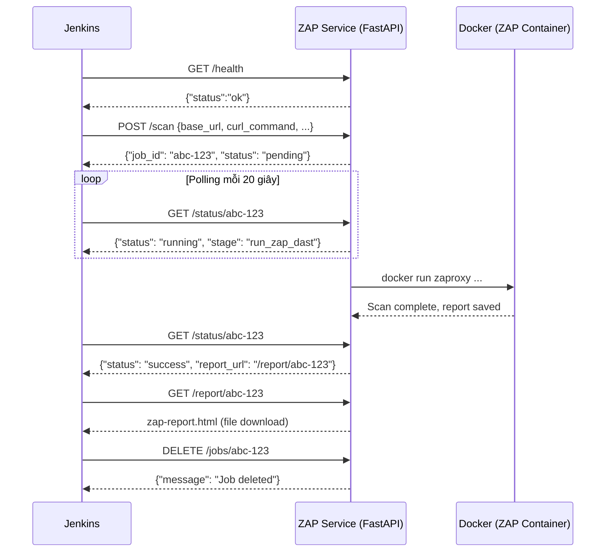

# ZAP DAST FastAPI Service — Implementation Walkthrough

## Cấu Trúc File Đã Tạo

```
nextgen-ebanking/
├── Jenkinsfile                          ← ĐÃ CẬP NHẬT (gọi HTTP thay vì bash)
└── security/
    ├── zap/                             ← Giữ nguyên (scripts gốc)
    │   ├── zap_pipeline.sh
    │   ├── zap_utils.py
    │   ├── zap_logger.js
    │   ├── automation.yaml.tpl
    │   └── postman_collection.json
    └── zap-service/                     ← MỚI — FastAPI Service
        ├── Dockerfile
        ├── docker-compose.yml
        ├── requirements.txt
        └── app/
            ├── __init__.py
            ├── main.py                  ← API endpoints
            ├── runner.py                ← Chạy zap_pipeline.sh
            ├── models.py                ← Pydantic schemas
            └── config.py               ← Đọc env vars
```

---

## Cách Hoạt Động



---

## Các Bước Triển Khai

### Bước 1: Build và khởi động ZAP Service

```bash
cd nextgen-ebanking/security/zap-service

# Build image
docker-compose build

# Khởi động service ở background
docker-compose up -d

# Kiểm tra health
curl http://localhost:8080/health
```

### Bước 2: Test thủ công trước khi chạy Jenkins

```bash
# Trigger scan
curl -X POST http://localhost:8080/scan \
  -H "Content-Type: application/json" \
  -d '{
    "base_url": "https://dev.example.com",
    "enable_prelogin": true,
    "login_curl_command": "curl -sS -X POST https://dev.example.com/api/login -d ... > zap-tmp/auth_response_raw.json",
    "docker_image": "ghcr.io/zaproxy/zaproxy:stable"
  }'

# Response: {"job_id": "abc-123", "status": "pending"}

# Polling status
curl http://localhost:8080/status/abc-123

# Xem full log
curl http://localhost:8080/logs/abc-123

# Tải report
curl -o report.html http://localhost:8080/report/abc-123
```

### Bước 3: Cấu hình Jenkins

1. Đảm bảo `ZAP_SERVICE_URL` trong `Jenkinsfile` trỏ đúng host:port của service.
2. Nếu Jenkins và service chạy cùng máy: `http://localhost:8080`
3. Nếu chạy trên máy khác: `http://<server-ip>:8080`

---

## API Reference

| Method | Endpoint | Mô tả |
|--------|----------|-------|
| `GET`  | `/health` | Health check |
| `POST` | `/scan` | Kích hoạt scan mới, trả về `job_id` |
| `GET`  | `/status/{job_id}` | Trạng thái + log tail |
| `GET`  | `/logs/{job_id}` | Toàn bộ pipeline log |
| `GET`  | `/report/{job_id}` | Tải báo cáo HTML |
| `GET`  | `/jobs` | Liệt kê tất cả jobs |
| `DELETE` | `/jobs/{job_id}` | Xoá workspace job đã xong |

Interactive Swagger UI: `http://localhost:8080/docs`

---

## Biến Môi Trường Service (docker-compose.yml)

| Biến | Mặc định | Mô tả |
|------|----------|-------|
| `ZAP_SCRIPTS_DIR` | `/app/zap-scripts` | Thư mục chứa scripts ZAP |
| `ZAP_WORKSPACE_ROOT` | `/app/workspace` | Thư mục workspace các jobs |
| `MAX_CONCURRENT_SCANS` | `3` | Số scan chạy song song tối đa |
| `LOG_LEVEL` | `INFO` | Level log của service |
| `LOG_TAIL_LINES` | `80` | Số dòng log cuối trả về trong status |

---

## Lưu Ý Quan Trọng

> [!IMPORTANT]
> Volume `/var/run/docker.sock:/var/run/docker.sock` **bắt buộc phải có** trong `docker-compose.yml`. Đây là cách service gọi `docker run zaproxy` từ bên trong container.

> [!WARNING]
> Mỗi scan job tạo một thư mục riêng trong `workspace/{job_id}/`. Jenkins tự động gọi `DELETE /jobs/{job_id}` ở bước `post.always` để dọn dẹp. Nếu skip bước này, cần dọn thủ công.

> [!TIP]
> Truy cập `http://localhost:8080/docs` để xem và test API trực tiếp trên Swagger UI.
